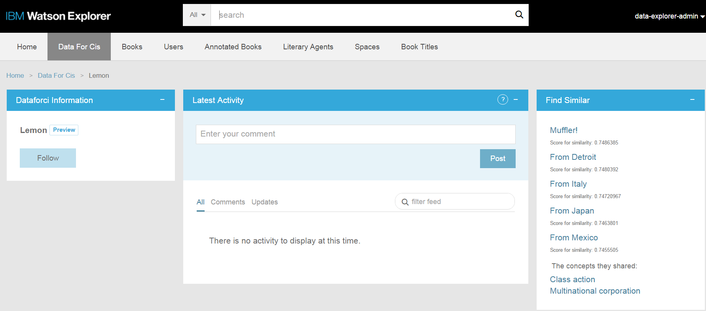

# Integrating the Watson Developer Cloud Concept Insights Service with Watson Explorer

[IBM Watson Explorer](http://www.ibm.com/smarterplanet/us/en/ibmwatson/explorer.html) combines search and content analytics with unique cognitive computing capabilities available through external cloud services such as the [Watson Developer Cloud](http://www.ibm.com/smarterplanet/us/en/ibmwatson/developercloud/) to help users find and understand the information they need to work more efficiently and make better, more confident decisions.

The [IBM Watson Concept Insights service](http://www.ibm.com/smarterplanet/us/en/ibmwatson/developercloud/concept-insights.html) enables users to work with concepts and identify conceptual associations in the content that you provide as input to the service. Input content is auto-tagged against a concept graph, which is a formal representation of the relationships between concepts that are present in the data on which it is based. The concept graph used by the Concept Insights service is based on content that has been ingested from the English language Wikipedia. The full Concept Insights reference is available on the [IBM Watson Concept Insights service website](http://www.ibm.com/smarterplanet/us/en/ibmwatson/developercloud/doc/concept-insights/index.shtml).

The goal of this tutorial is to demonstrate how to get started with an integration between Watson Explorer and the Watson Concept Insights service available on IBM Watson Developer Cloud. By the end of the tutorial you will have a Concept Insights Bluemix application, a Watson Explorer Engine converter which sends crawled data to Concept Insights service, and a Concept Insights widget for Watson Explorer Application Builder that finds similar entities based on concepts they all shared.



## Prerequisites
Please see the [Introduction](https://github.com/Watson-Explorer/wex-wdc-integration-samples) for an overview of the integration architecture, and the tools and libraries that need to be installed to create Java-based applications in Bluemix.

- An [IBM Bluemix](https://ace.ng.bluemix.net/) account
- [Watson Explorer](http://www.ibm.com/smarterplanet/us/en/ibmwatson/explorer.html) - Installed, configured, and running
- The Watson Explorer [AppBuilder tutorial](http://www.ibm.com/support/knowledgecenter/SS8NLW_10.0.0/com.ibm.swg.im.infosphere.dataexpl.appbuilder.doc/c_de-ab-devapp-tutorial.html) has been completed
- The [Application Builder proxy](https://github.com/Watson-Explorer/wex-wdc-integration-samples/tree/master/proxy) up and running.


## What's Included in this Tutorial

This tutorial will walk you through the creation of a Bluemix Application, two Watson Explorer Engine Web Service converters, and a Watson Explorer Application Builder "Similar Books" widget. The Bluemix Application will first create a new corpus in Concept Insights service and take all the data we send from Watson Explorer Engine and pass them to this corpus. The Bluemix Application will then take the query from the Watson Explorer Application Builder Similar Books widget, pass it to the Concept Insights service and send the response back. The Watson Explorer Application Builder Similar Books widget sends the id of an entity to the Application Builder proxy, which in turn sends the information to the Bluemix application, which in turn sends the information to the Concept Insights service, which responds with details of similar entities and all the concepts they share.


## Step-by-Step Tutorial

This section outlines the steps required to configure and deploy the Watson Explorer Application Builder Similar Books widget.

### Create the Concept Insights sample application in Bluemix

The Bluemix documentation can be found [here](https://www.ng.bluemix.net/docs/).

Clone this Git repository, or download the zip, extract, and navigate to the repository directory on the command-line.

The example Bluemix application included in the Git repository uses a `manifest.yml` file to specify the application name, services bindings, and basic application settings.  Using a manifest simplifies distribution and deployment of CloudFoundry applications.

To deploy the Watson Concept Insights sample application you'll need to compile the application and deploy it to Bluemix.

If you have not done so already, sign in to Bluemix.

```
$> cf api api.ng.bluemix.net
...
$> cf login
```

Build the application web service using [Apache Maven](http://maven.apache.org/). Before performing this step, verify that you are in the `/bluemix` directory of this repository. This will generate a Java WAR called `wex-wdc-Concept-Insights-sample.war`.

```
$> mvn install
```


Next, deploy the application to your space in the Bluemix cloud.  Subsequent pushes to Bluemix will overwrite the previous instances you have deployed.

```
$> cf push
```


Once the application has finished restarting, you should now be able to access the sample application.  You can view the route that was created for your application with `cf routes`.  The running application URL can be determined by combining the host and domain from the routes listing.  You can also find this information in the `manifest.yml` file.

Finally, go to the Bluemix Application webpage with the name you specified: http://YOUR_BLUEMIX_HOST.mybluemix.net. It will allow you to create a new private corpus with the input name.

1. Input "test" and click "submit", and a new private corpus named "test" will be created for further query.


### Add the Watson Explorer Engine Web Services Converter to your Engine installation

If you are using Watson Explorer version 11 or greater, you already have the Web Services Converter and can skip this step.  The [Watson Explorer Engine Web Services Converter](https://github.com/IBM-Watson/wex-web-services-converter) is a [converter](http://www.ibm.com/support/knowledgecenter/SS8NLW_10.0.0/com.ibm.swg.im.infosphere.dataexpl.engine.doc/c_vse_converting.html) like any other that processes text to be indexed at ingestion time.  When the Web Services Converter is configured properly, it will send administrator-defined name-value pairs as CGI parameters to a REST-based web service. The Web Services Converter is XML, so it can be added to your Engine installation easily via copy-and-paste.


 1. Navigate to the [Web Services Converter XML source](https://github.com/IBM-Watson/wex-web-services-converter/tree/master/engine/function.vse-converter-webservice.xml), select and copy all the XML there.
 2. Navigate to your Watson Explorer Engine administrative interface.  Select the "Configuration" menu.  Click the "+" next to the "XML" item in the left menu to add new XML.
 3. You will be prompted to provide an Element and Name.  Enter "function" and "vse-converter-webservice" respectively, without quotes.  Click the **Add** button at right.
 4. You will see minimal XML representing the new function.  Select that XML and paste in the Web Services Converter XML you copied in step 1.  Click the **OK** button at right.

There are alternative methods for adding XML to your Engine installation, including via the repository-supplements directory, via peer repository configuration, and via the repository-add API function, but explanation of those methods is beyond the scope of this example.

### Create a new collection with the Web Services Converter

 1. Navigate to your Watson Explorer Engine administrative interface.  Select the "Configuration" menu.  Click the "+" next to the "Search Collections" item in the left menu to create a new collection.
 2. For "Copy defaults from" select "example-appbuilder".  This allows us to start with a pre-configured small example collection.  Name the collection and click the **Add** button at right.
 3. Select your collection's "Configuration" and then the "Converting" tab.  Click the **Add a new converter** button.  Scroll down and select the "Web Services" converter and click **Add**.
 4. In the "Web Service endpoint URL" text box, supply the endpoint URL for your application which exposes the Concept Insights service, which will be: http://YOUR_BLUEMIX_APP.mybluemix.net/api/createDoc.
 5. In the "Contents to send as name/value pairs" text area, enter "name", "data" and "corpusName" on different lines without quotes.  Click the **OK** button at right.

### Create the custom converter which pre-processes the text

REST-based web services take input in the form of CGI parameters.  CGI parameters are name-value pairs.  `<content>` elements also have a name and a value.  This similarity is leveraged by the Web Services converter.  In the configuration for the Web Services converter, `<content>` elements are identified by name, and those content names and related content values are sent as CGI parameter names and values to the web service.

The Concept Insights service expects two parameters from engine: "name" and "data".

 * The value of "name" identifies the id and label for the document saved in the corpus in the Concept Insights service.
 * The value of "data" is the text of each document from which you want to extract concepts.

To prepare the data for use by the Web Services converter, we must create a custom converter that:

 1. Copies all input to the output.  This should preserve all XML input, including all XML elements and their attributes.
 2. Generates new `<content>` elements.  One new `<content>` should be created for each CGI parameter that must be sent to the web service.
 
 *Note*:  In some cases your `<document>` may already have a `<content>` whose name is the same as one of the web service CGI parameters.  If this `<content>` already accurately represents a name-value pair that must be sent to the web service, then no further action is necessary.  If, however, the `<content>` should not be sent but has a name which matches a CGI parameter name that must be sent, then this pre-processing converter must **_replace_** this `<content>` with a new `<content>` with a new name.  The value can be moved back into a `<content>` with the original name in the custom post-processing converter.
 
The following XSL can be dropped into a custom converter to accomplish this.  The following XSL:

 1. Copies all input to the output.
 2. Creates a new `<content>` named "corpusName" and gives it a value of "test".
 3. Creates a new `<content>` named "name" and gives it a value of the `<content>` named "title" into it.
 4. Creates a new `<content>` named "data" and copies the value of the `<content>` named "snippet" into it.  The "snippet" `<content>` often contains the bulk of the unstructured text that will be indexed.

```xml

	<xsl:template match="/">
	  <xsl:apply-templates select="@*|node()" />
	</xsl:template>
	
	<xsl:template match="@*|node()">
	  <xsl:copy>
	    <xsl:apply-templates select="@*|node()" />
	  </xsl:copy>
	</xsl:template>
	
	<xsl:template match="document">
   	  <xsl:copy>
       <xsl:apply-templates select="@*|node()" />

       <!-- that takes care of copying the contents, now add any new ones -->
      <content name="corpusName">test</content>

     </xsl:copy>
	</xsl:template>

	<xsl:template match="content[@name='title']">
	  <xsl:copy>
	    <xsl:apply-templates select="@*|node()" />
	  </xsl:copy>
	  <!-- copy the title, but also add a content to send to the webservice -->
	  <content name="name">
	    <xsl:value-of select="./text()" />
	  </content>
	
	</xsl:template>
	
	<xsl:template match="content[@name='snippet']">
	  <xsl:copy>
	    <xsl:apply-templates select="@*|node()" />
	  </xsl:copy>
	
	  <!-- copy the snippet, but also add a content to send to the webservice -->
	  <content name="data">
	    <xsl:value-of select="./text()" />
	  </content>
	
	</xsl:template>
```

To create a custom converter with the above XSL, follow these steps:

 1. Click the **Add a new converter** button, select "Custom converter", and click **Add**.
 2. For "Type-In" select "application/vxml-unnormalized".
 3. For "Type-Out" select "application/vxml-unnormalized".
 4. Give your converter a name, for example "Pre-processor for web service"
 5. For "Action" select "xsl".
 6. Paste the above XSL into the text area.
 7. Click the **OK** button at right.
 8. Ensure that the new "Pre-processor for web service" converter appears in the converter list **prior** to the Web Services converter.


### Crawl the documents and send to Concept Insights service

Navigate to "overview" menu of the collection you just created. In "Live Status" section, click "start" to start crawling. All the document data will be uploaded into the corpus you created in Concept Insights service. After this step, you should be ready to search the information in your Concept Insights service corpus.

### Modify the Application Builder proxy

A simple [proxy](https://github.com/Watson-Explorer/wex-wdc-integration-samples/tree/master/proxy) was developed to run on the Application Builder server to satisfy the same-origin policy of end-user web browsers when individual widgets need to contact other hosts (for example, in Bluemix) via Ajax. To support this new chain of communication, modifications are made to the Application Builder proxy.  

Make the following changes to the sample Proxy.

1. Navigate to the proxy installation directory.  This is typically under the Watson Explorer installation directory at `AppBuilder/wlp/usr/servers/AppBuilder/apps/proxy`.
2. Edit the `WEB-INF/config.ru` file.  Add the following line near the other similar lines, replacing `YOUR_BLUEMIX_HOST` with the host you chose above in your manifest.yml.
   
   `set :ci_endpoint, "http://YOUR_BLUEMIX_HOST.mybluemix.net/api/search"`
3. Enter the `lib/proxy.rb` file and add the following code block

   ```
	post '/ci/' do
   		data = JSON.load(request.body)
		body = { :ids => data["ids"], :corpusName => data["corpusName"]} 
		body = URI.encode_www_form(body)
	    headers = {
	         "Content-Type" => "application/x-www-form-urlencoded"
	    }
	    response = Excon.post(settings.ci_endpoint, :body => body, :headers => headers)
	    response.body
		end
   	```

### Create a Watson Explorer Application Builder widget for Concept Insights

Assuming you have completed the [Application Builder tutorial](http://www.ibm.com/support/knowledgecenter/SS8NLW_10.0.0/com.ibm.swg.im.infosphere.dataexpl.appbuilder.doc/c_de-ab-devapp-tutorial.html) listed in the Prerequisites, you will have some book entities.  Let's add a Concept Insights widget that will show similar books.

#### Build and configure a widget that sends queries to the Watson Concept Insights API

The purpose of this example widget is to send a book's name to the Watson Concept Insights API via the application we created in Bluemix.  The results returned by the Concept Insights widget will be displayed in the Application Builder UI.

Once you have logged into the Application Builder administrative interface, follow these steps to create the custom widget and add it to the search page.

1. Navigate to the Pages & Widgets > books > detail page.
2. Create a new Custom widget.
3. Set the ID of the widget to be `WDC_Concept Insights`
4. Set the Display name of the widget to be `Similar Books`
5. Copy and paste the [code for this widget](appbuilder/concept-insights-widget.erb) into the Type-specific Configuration.
6. Save the widget.
7. Go back to the books > detail page.
8. Drag the `WDC_Concept Insights` widget to the top of the right column and save the page configuration.


**NOTE:** At this point the widget should be fully configured. 


# Implementation Considerations

- **Synchronization Issue** - The corpus in Concept Insights service is a copy of the data we index in Watson Explorer Engine, which can lead to a synchronization issue. When the collection is refreshed, some documents may be deleted from the Engine index, but those documents will still exist in the Concept Insights corpus. There are three possible ways to solve this problem. (We use the third way in this integration.) 
	1. Never refresh the collection.  If documents must be updated, delete the corpus and recrawl the collection.
	2. Dump all document ids from the Engine index before and after the refresh.  Process these lists to produce a list of deleted document ids.  Process the list to delete the documents from the corpus.
	3. After we get the results from Concept Insights service, we make a query to index and only display those documents that still exist in the Engine index.
- **Privacy and Security** - The Concept Insights widget makes a web request to the Bluemix application endpoint configured in the Application Builder proxy.  In this example, the example Bluemix application is completely open and has no security.
- **Failures will happen** - All distributed systems are inherently unreliable and failures will inevitably occur when attempting to call out to Bluemix.  Consider how failures should be handled.
- **Data Preparation** - It is the responsibility of the caller to ensure that representative data is being sent to the Concept Insights service.  Additional data preparation may be required in some cases.  Choose content carefully and be sure you are sending a clean query.
- **Scalability** - This example uses only a single cloud instance with the default Bluemix application settings.  In a production scenario consider how much hardware will be required and adjust the Bluemix application settings accordingly.

## Caching Proxy
Given the considerations listed here, the use of a caching proxy is always recommended in a Production environment.  Using a caching proxy can speed up widget refreshes in some situations and overcome some network failures.


# Licensing
All sample code contained within this project repository or any subdirectories is licensed according to the terms of the MIT license, which can be viewed in the file license.txt.


# Open Source @ IBM
[Find more open source projects on the IBM Github Page](http://ibm.github.io/)
